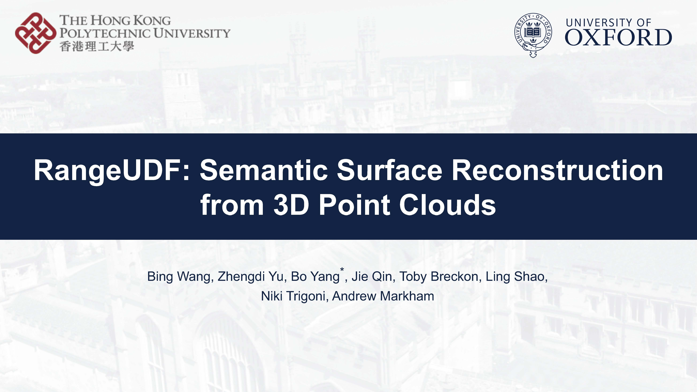

# RangeUDF: Semantic Surface Reconstruction from 3D Point Clouds

This is the official repository of the **RangeUDF**. For technical details, please refer to:

**RangeUDF: Semantic Surface Reconstruction from 3D Point Clouds**  
[Bing Wang](https://www.cs.ox.ac.uk/people/bing.wang/), [Zhengdi Yu](), [Bo Yang](https://yang7879.github.io/), [Jie Qin](https://sites.google.com/site/firmamentqj/), [Toby Breckon](https://breckon.org/toby/), [Ling Shao](https://scholar.google.com/citations?user=z84rLjoAAAAJ&hl=en), [Niki Trigoni](https://www.cs.ox.ac.uk/people/niki.trigoni/), [Andrew Markham](https://www.cs.ox.ac.uk/people/andrew.markham/).  
**[[Paper](http://arxiv.org/abs/2204.09138)] [[Video](https://youtu.be/YahEnX1z-yw)]**  

### Video Demo (Youtube)

  

### Qualitative Results
|    |  |
| --------------------------------------- | ------------------------------------- |
|    |  |
|    |  |

### Citation
If you find our work useful in your research, please consider citing:

      @article{wang2022rangeudf,
      title={RangeUDF: Semantic Surface Reconstruction from 3D Point Clouds},
      author={Bing, Wang and Zhengdi, Yu and Yang, Bo and Jie, Qin and Toby, Breckon and Ling, Shao and Trigoni, Niki and Markham, Andrew},
      journal={arXiv preprint arXiv:2204.09138},
      year={2022}
    }
